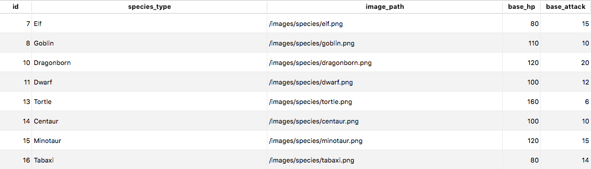

# Dungeons and Dragons

## Description ##
Final project for Makers Academy.

An application to assist Dungeon Masters in the set up and running of a Dungeons and Dragons campaign.

## Technologies Used ##
* ASP.NET Core 2.2
* ASP.NET MVC 5
* .NET Framework 4.7.2
* .NET Standard 2
* NUnit
* PostgreSQL
* Entity Framework
* C#
* HTML
* CSS
* Bootstrap

## Process ##
Our [wiki](https://github.com/aimeecraig/dungeons-and-dragons/wiki) discusses our production process for this challenge.

## How to Install and Use ##
1. Clone the repository

```
git clone https://github.com/aimeecraig/dungeons-and-dragons.git
```

2. Navigate into the project directory
```
cd dungeons-and-dragons
```

## How to Set Up Databases ##

(Database Migration info to go here)

## appsettings
Create an `appsettings.json` file in the `/dungeons-and-dragons/DungeonsAndDragons/DungeonsAndDragons` directory with the below code snippet. Ensure that you update the Username and Password key value pairs with the username and password you will be using to access your database.

```csharp
{
    "Logging": {
        "LogLevel": {
            "Default": "Warning"
        }
    },
    "AllowedHosts": "*",
    "ConnectionStrings": {
        "DefaultConnection": "Host=localhost;Port=5432;Username=username;Password=password;Database=dungeons_and_dragons;"
    }
}
```

(Run migrations)

## Setup Foreign Keys
In the `gamesusers` table set the following foreign keys:
* gameid => games.id
* userid => users.id
* playablecharacterid = playablecharacters.id (nullable = true)

In the `playablecharacters` table set the following foreign keys:
* userid = users.id

## Setup Species Table
To add the species, please enter the following entries into your migrated species table:



## Contributors ##
* [Aimee Craig](https://github.com/aimeecraig)
* [John Littler](https://github.com/JSLittler)
* [Melissa Sedgwick](https://github.com/melissasedgwick)
* [Terry Mace](https://github.com/Tolvic)
